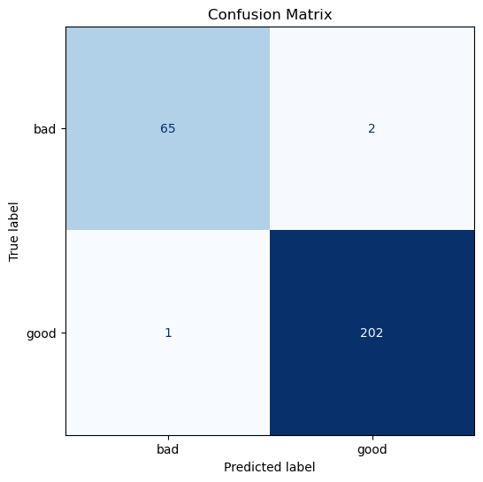

# 画像品質分類レポート  
## ロゴ画像における汚れ検出

---

## 1. 目的 / KPI

**目的：**  
黒背景中央に配置された円形ロゴに付着した汚れなどの有無に基づき、製品画像を **good / bad** に自動分類する。
本タスクはロゴ形状自体はほぼ同一であり、差分は微細な汚れや傷である。
したがって、単純な分類問題というより、正常状態からの逸脱を検出する異常検知的な性質を持つと考えられる。

**KPI：**

| 指標 | 優先度 | 理由 |
|---|---|---|
| bad → good の件数 | 最重要 | 不良品（bad）を見逃すと、そのまま出荷されてしまい重大な問題となるため |
| good → bad の件数 | 次点 | 良品（good）を誤ってbadと判定しても再検査で対応可能（コストはかかるが致命的ではない） |
| 推論速度（秒/枚） | 運用上重要 | GPUなしのCPU環境でも実用可能である必要がある。社員の方との面談では、実運用上は数msレベルの推論速度が望ましいとの示唆をいただいた。 |

まず教師あり分類でベースラインを構築し、その後、問題の性質に基づき異常検知手法を検討した。
さらに、それぞれの弱点を補うためにアンサンブルを試した。

---

## 2. 試した手法

| # | 手法 | スクリプト |
|---|---|---|
| 1 | 教師あり分類（ResNet-18のファインチューニング） | `train.py` / `inference.py` |
| 2 | 異常検知（PatchCore, 特徴ベースk-NN） | `train_anomaly.py` / `inference_anomaly.py` |
| 3 | アンサンブル（PatchCore + 分類モデル） | `train_anomaly.py` / `inference_anomaly.py` |

---

## 3. 各手法の説明

### 3-1. 教師あり分類（ResNet-18）

ImageNetで事前学習されたResNet-18を用い、ラベル付きデータでファインチューニングを行った。最終の全結合層のみを置き換え、2クラス（good / bad）出力とした。

---

### 主な設計

| 項目 | 値 | 理由 |
|---|---|---|
| 入力解像度 | 320 px | 224 pxでは微細な汚れが潰れるため、高解像度で保持 |
| badクラス重み | 2.5 | クラス不均衡（bad約350、good約1000）への対応 |
| 最適化手法 | Adam（lr=1e-4） | 安定したファインチューニング |
| LR scheduler | ReduceLROnPlateau（patience=3） | 検証損失停滞時に自動でLRを下げる |
| エポック数 | 20 | 十分な収束を確保 |
| 判定閾値 | 0.3 | bad recall向上のため0.5から低減 |

---

### データ拡張（学習時のみ）

| 変換 | 目的 |
|---|---|
| `RandomRotation(degrees=180)` | 回転はラベルに影響しないため、完全な回転不変性を付与 |
| `RandomAffine(degrees=0, scale=0.95–1.05)` | カメラ距離の軽微なズーム変化に対応 |
| `ColorJitter(brightness=0.15, contrast=0.15)` | 照明条件の変化に対するロバスト性向上 |
| `RandomAdjustSharpness(p=0.3)` | 汚れによる細かいテクスチャやエッジを学習しやすくする |

---

### 3-2. 異常検知（PatchCore）

PatchCoreは教師なし異常検知手法であり、**学習時にはgood画像のみを使用**する。

処理の流れ：

1. **学習（Fit）**  
   good画像をResNet-18に通し、中間層の特徴を抽出して **memory bank** に保存する  
2. **スコア計算（Score）**  
   新しい画像の特徴とmemory bankとの距離（k-NN）を計算  
3. **判定（Threshold）**  
   距離が大きいほど異常（bad）と判定  

---

### 特徴抽出層

| 層 | チャンネル数 | 空間サイズ | 役割 |
|---|---|---|---|
| layer1 | 64 | H/4 | 微細な汚れ検出 |
| layer2 | 128 | H/8 | 中レベル特徴 |
| layer3 | 256 | H/16 | 意味的特徴 |

layer1をpoolingしてlayer2と結合し、448次元特徴を生成。  
memory bankは10%にサンプリングして軽量化。

---

### 分類モデルとの違い

- badデータ不要で学習可能  
- 未知の汚れにも対応しやすい  

---

### 3-3. アンサンブル（PatchCore + 分類モデル）

難しいbadサンプルでは両モデルともに識別が困難だったため、組み合わせて補完。

---

### 判定ロジック

以下の条件で bad と判定：

(PatchCoreスコア > pc_threshold AND P(bad) > veto_threshold)
OR
P(bad) > clf_threshold

---

### パラメータ

| パラメータ | 値 | 役割 |
|---|---|---|
| pc_threshold | 4.52 | PatchCoreの閾値 |
| clf_threshold | 0.5 | 高信頼badの検出 |
| veto_threshold | 0.05 | PatchCoreの誤検出を抑制 |

---

## 4. 結果

### 4-1. 分類モデル

**検証セット（270枚）：**

| 指標 | 数 |
|---|---|
| 総ミス数 | 3 |
| bad → good | 2 |
| good → bad | 1 |
| Accuracy | 0.9889 |

**全データ推論（1350枚, inference.py, threshold=0.3）：**

| 指標 | 数 |
|---|---|
| 総ミス数 | 14 |
| bad → good | 3 |
| good → bad | 11 |
| 推論速度 | 約0.08 秒/枚（CPU） |

---

### 4-2. PatchCore

| 指標 | 値 |
|---|---|
| ROC-AUC | 0.9754 |
| bad recall | 95.52% |
| 誤分類数 | 22 |

PatchCoreはROC-AUC自体は高く、問題設定との整合性も高かった一方で、
境界的なbadサンプルとgoodサンプルの分布の重なりを完全には解消できず、
またCPU環境での推論速度にも課題が残った。

---

### 4-3. アンサンブル

**検証セット（270枚）：**

| 条件 | bad→good | good→bad | 合計 |
|---|---|---|---|
| PatchCoreのみ | 3 | 19 | 22 |
| + classifier (threshold 0.5 + veto) | 1 | 4 | 5 |

**全データ推論（1350枚, inference_anomaly.py）：**

| 指標 | 数 |
|---|---|
| 総ミス数 | 21 |
| bad → good | 4 |
| good → bad | 17 |
| 推論速度 | 約1.25秒/枚（CPU） |

---

## 5. 考察

一部のbadサンプルはgoodと特徴空間上で非常に近く、両モデルともに低いスコアを与える傾向があった。
これは、微細な汚れが特徴的に弱く、正常分布と大きく重なっていることを示唆している。
代表例として、下記の画像では目視でも薄い傷しか確認できず、人間にとっても境界的と感じられるサンプルであった。

特に分類モデルでは、難易度の高いbadサンプルに対してP(bad)が非常に低くなる傾向があり、
それらを検出するために閾値を下げると、多数のgoodサンプルが誤検出されるトレードオフが存在した。

以上のバランスを踏まえて、今回の結果が出るシステム設計を行なった。

---

### 改善

| 施策 | 効果 |
|---|---|
| class weight増加 | recall改善 |
| scheduler追加 | 学習安定 |
| PatchCore改善 | AUC向上 |
| アンサンブル | 見逃し削減 |

---

### 限界

- 境界的なbadサンプル存在  
- PatchCoreは推論が遅い（CPUで約2.4秒/枚）

---

## 最終結論

本タスクは異常検知的な性質を持つが、今回のデータではbadラベル付きサンプルが一定数存在するため、
異常検知よりも教師あり分類の方が、具体的な汚れパターンを直接学習できるという利点がある。

実験の結果、分類モデルの方が難易度の高いbadサンプルに対しても相対的に高い識別性能を示した。
また、PatchCoreはk-NN探索を含むため計算コストが高く、CPU環境では約2.4秒/枚と推論が遅く、
実運用上求められる短い推論時間を満たさなかった。

一方、分類モデルは単一のforward計算で推論可能であり、速度と精度の両立が可能である。
以上より、本課題では異常検知の視点を比較・考察に活かしつつ、最終的な提出モデルとしては
ResNet-18ベースの教師あり分類モデルを採用する判断が最も妥当であると結論づけた。